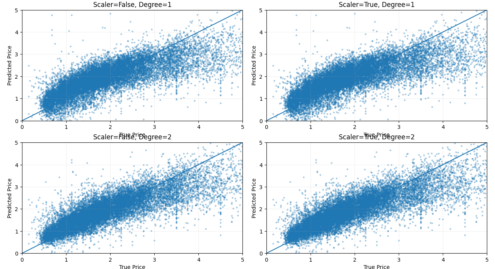

# California Housing · Price Prediction

> Linear Regression baseline → feature engineering → systematic ablation study


---

## Overview

A structured machine learning project that benchmarks Linear Regression on the [California Housing Dataset](https://scikit-learn.org/stable/datasets/real_world.html#california-housing-dataset). The project is split into two phases:

1. **Baseline** (`baseline_model.py`) — clean pipeline: load → filter → split → train → evaluate → visualize
2. **Ablation Study** (`sklearn（plus）.py`) — 2×2 factorial experiment across `StandardScaler` × `PolynomialFeatures(degree=2)`, with 5-fold cross-validation on each configuration

---

## Results

| Config | Scaler | Degree | MSE ↓ | R² ↑ | CV Score |
|--------|--------|--------|-------|------|----------|
| A | ✗ | 1 | — | — | — |
| B | ✓ | 1 | — | — | — |
| C | ✗ | 2 | — | — | — |
| D | ✓ | 2 | — | — | — |

> Run `sklearn（plus）.py` to populate the table.

---

## Visualizations

### Baseline — True vs. Predicted

The scatter plot compares true house prices (x-axis) vs. predicted prices (y-axis). The diagonal represents a perfect predictor — tighter clustering means better performance.


---

### Ablation Study — 4-Config Comparison

Each subplot corresponds to one experimental configuration. Comparing the four panels reveals the independent and combined effects of scaling and polynomial feature expansion.



**Reading the grid:**

| | Degree = 1 | Degree = 2 |
|---|---|---|
| **No Scaler** | Top-left | Bottom-left |
| **With Scaler** | Top-right | Bottom-right |

> Degree=2 visibly tightens the point cloud around the diagonal, especially in the mid-price range (1.5–3.5). Scaler alone has minimal effect on Linear Regression — its benefit compounds when combined with polynomial features.

---

## Project Structure

```
.
├── baseline_model.py          # Baseline pipeline: data → train → evaluate → plot
├── sklearn（plus）.py          # Ablation study: 4 configs × (MSE, R², CV)
├── true_vs_pred.png           # Scatter plot from baseline
├── true_vs_pred（plus）.png    # 2×2 subplot from ablation study
└── README.md
```

---

## Quickstart

```bash
# Install dependencies
pip install scikit-learn numpy matplotlib

# Run baseline (generates true_vs_pred.png)
python baseline_model.py

# Run ablation study (generates 2×2 comparison plot)
python "sklearn（plus）.py"
```

---

## Pipeline

```
fetch_california_housing()
        │
        ▼
  Filter: y < 5.0              ← removes capped/outlier values
        │
        ▼
  train_test_split              ← train_size=0.2, random_state=42
        │
        ├──[plus only]──► PolynomialFeatures(degree=d)
        │
        ├──[plus only]──► StandardScaler()
        │
        ▼
  LinearRegression.fit()
        │
        ▼
  .predict()  ──►  MSE, R², cross_val_score(cv=5)
        │
        ▼
  Scatter plot (true vs. predicted)
```

---

## Key Design Choices

**`train_size=0.2`** — deliberately small training set to stress-test generalization. Production models should use a larger split; this is intentional for experimentation.

**Price cap filter (`y < 5.0`)** — the dataset caps values at 5.0, creating artificial density at the ceiling. Removing these reduces label noise and prevents the model from learning the cap as a feature.

**Ablation axes**
- *StandardScaler* — Linear Regression is scale-invariant in theory, but polynomial features benefit from normalized inputs to avoid numerical instability.
- *PolynomialFeatures(degree=2)* — introduces interaction terms (e.g., `income × rooms`), allowing the linear model to capture non-linear relationships at the cost of feature explosion.

---

## Metrics Reference

| Metric | Formula | Interpretation |
|--------|---------|----------------|
| **MSE** | `mean((y - ŷ)²)` | Average squared error; penalizes large mistakes heavily. Lower is better. |
| **R²** | `1 - SS_res / SS_tot` | Proportion of variance explained. 1.0 = perfect; 0 = predicts the mean. |
| **CV Score** | 5-fold cross-validated R² | Estimates generalization. High variance here signals overfitting. |

---

## Notes

- `random_state=42` is set throughout for reproducibility.
- Cross-validation in the ablation study runs on the **training split only** — test data is never touched during model selection.
- Polynomial degree=3+ is intentionally excluded to avoid severe overfitting at `train_size=0.2`.
