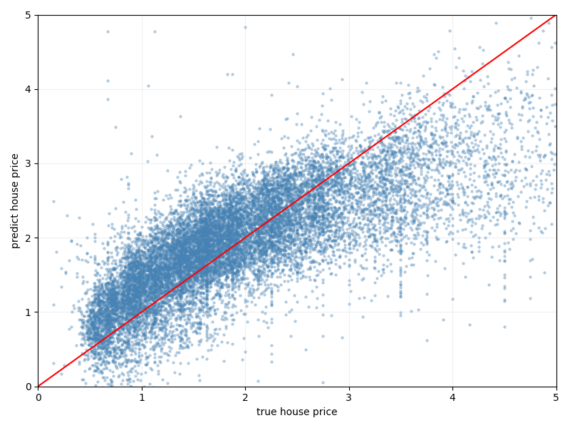

# 🏠 California Housing Price Prediction
A beginner-friendly machine learning project using **scikit-learn** to predict California housing prices with Linear Regression.
---
## 📌 Project Overview
This project trains a Linear Regression model on the [California Housing Dataset](https://scikit-learn.org/stable/datasets/real_world.html#california-housing-dataset) to predict house prices, and visualizes the prediction results with a scatter plot.
---
## 📉 Visualization
The scatter plot compares **true house prices** (x-axis) vs **predicted house prices** (y-axis).  
The red diagonal line represents perfect predictions — the closer the dots are to this line, the better the model.

> The model captures the overall trend well, though scatter increases at higher price ranges — typical behavior for Linear Regression on this dataset.
---
## 🗂️ Project Structure
├── main.py                     # Main script: data loading, training, evaluation, visualization
├── prediction_plot.png         # Visualization output
└── README.md
---
## 🔧 Dependencies
pip install scikit-learn numpy matplotlib
---
## 🚀 How to Run
python main.py
---
## 📊 Pipeline
Load Data (fetch_california_housing)
    ↓
Filter outliers (y < 5.0)
    ↓
Split Data (train_test_split, train=20%)
    ↓
Train Model (LinearRegression.fit)
    ↓
Predict (model.predict)
    ↓
Evaluate (MSE, R²)
    ↓
Visualize (scatter plot: true vs predicted)
---
## 📈 Evaluation Metrics
| Metric | Description |
|---|---|
| **MSE** (Mean Squared Error) | Average squared error between predicted and true values. Lower is better. |
| **R²** (R-squared) | How well the model explains data variance. Closer to 1 is better. |
---
## 🧠 Key Concepts
- train_test_split — Splits dataset into training and testing sets
- LinearRegression — Fits a linear model: y = Xw + b
- .fit() — Trains the model on training data
- .predict() — Generates predictions on test data
- joblib — Can be used to save and reload the trained model
---
## 📝 Notes
- Housing prices above 5.0 (likely capped values) are filtered out to reduce noise.
- train_size=0.2 means only 20% of the data is used for training — intentionally small for experimentation.
- random_state=42 ensures reproducibility.
